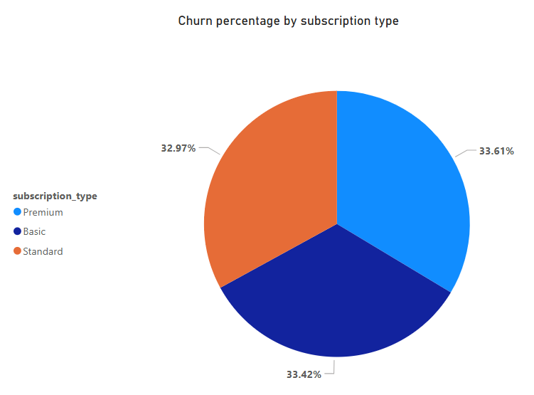
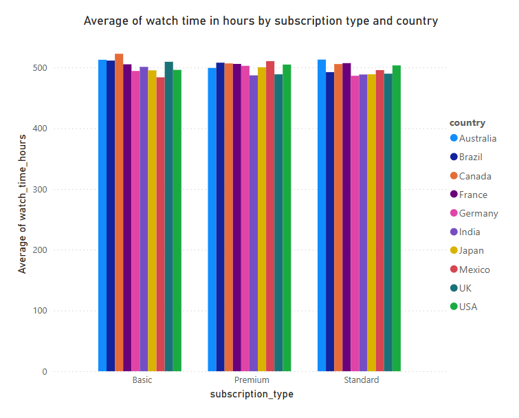
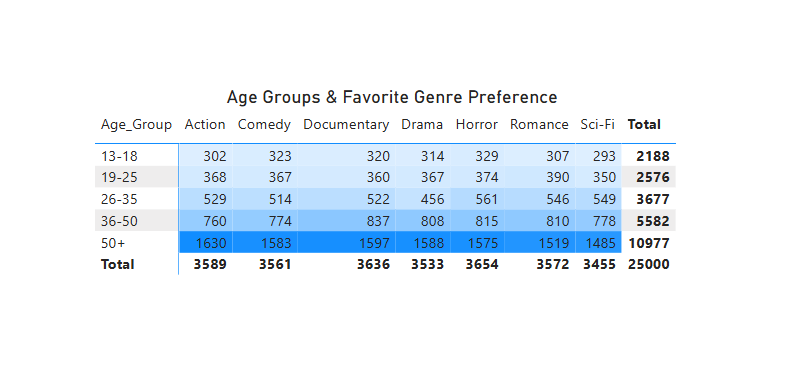
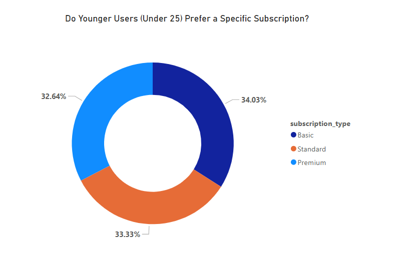

# Netflix User Behavior & Subscription Analytics

## Setup
- Download link: https://www.kaggle.com/datasets/smayanj/netflix-users-database
## Importing methods
```sql
load data infile 'C:/ProgramData/MySQL/MySQL Server 8.0/Uploads/netflix_users.csv'
into table netflix.users
fields terminated by ','
enclosed by '"'
lines terminated by '\n'
ignore 1 rows;
```

## Break the Database into multiple tables for efficient querying 
- Users (User_ID, Name, Age, Country, Subscription_Type)
- Watch_History (User_ID, Watch_Time_Hours, Favorite_Genre, Last_Login)
- Churn_Analysis (User_ID, Predicted_Churn, LastUpdated)

## MySQL Querying
### **General Analytical Questions**
1. Retrieve the total number of users in the dataset.  
2. Find the average age of users for each subscription type.  
3. List the number of users per country.  
4. Determine the most popular subscription type based on user count.  
5. Find the total watch time for each subscription type.  
6. Calculate the average watch time per user.  
7. Identify the top 5 users who have watched the most hours.  
8. Get the count of users who have logged in within the last 30 days.  
9. Find the percentage of users subscribed to each subscription type.  
10. Retrieve the most common favorite genre among all users.  
11. Identify the least common favorite genre.  
12. List the number of users for each age group (e.g., 13-18, 19-25, 26-35, etc.).  
13. Find users who have watched more than 100 hours in the last month.  
14. Get the country with the highest total watch time.  
15. Determine the average watch time per user per country.  

### **Visualizations (Power BI)**

- 
- 
- 
- 


## Important Functionalities
### **Stored Procedures & Views** 
#### Using Stored Procedures to gain Country-wise statistics
- Country = France | USA | India | Canada | Mexico | Japan | Australia | Germany | Brazil | UK
- Total_users
- Average_watch_time
- Favorite_genre
- Subscription_type
- Churn_rate

### **Indexing & Query Optimization**
- Speed up large dataset operations.
- Indexed the country column making any country based querying faster!
